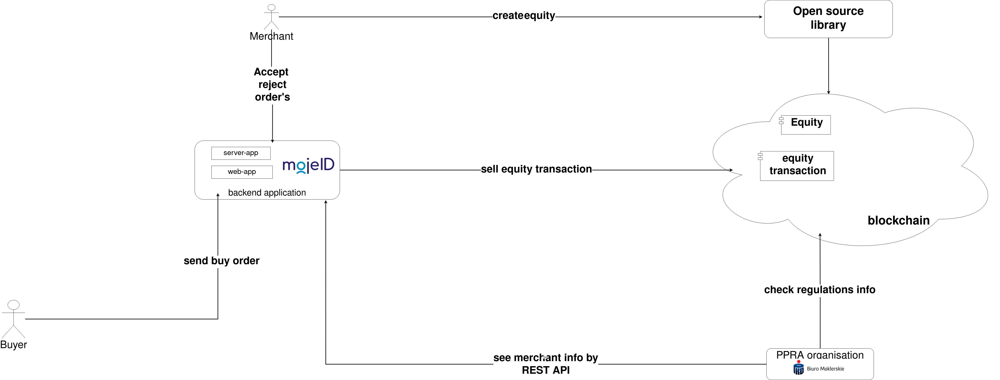

## SIRA CCC lib

The solution allows merchants to sell their own Equities and be compliant with CCC/SIRA regulation rules.  

The framework consists of two applications:

1) The library that creates Equity records in a particular block-chain. At this time 3 blockchains are supported. 
The library itself is open source, thus can be extended by any new crypto or FIAT currency instrument.

2) The Back-office application. The module is also an open source client-server application. 
It helps a merchant accept/reject new Buy orders and publish the resulting transaction in a blockchain.
The back-office application provides REST API and GUI interface. So each party can check regulatory information, or just to browse a list of transactions.


The solution is relaying on two dependencies:
- [https://www.mojeid.pl/](https://www.mojeid.pl) to verify identity;
- [https://www.bm.pkobp.pl/](https://www.bm.pkobp.pl/) - as a PPRA registry;

Below is the overall flow-diagram:



<br/>

The major part of the Library itself is already done. See the code here: [link](https://github.com/kosik/dogej/) 

The initial back-office API and message-response structure is below:


```
POST </authorization>
MojeID token

POST </login>
String REQ pass
String REQ identity-key

POST </shareholders>
A method that issues shareholder data.

POST </issuers>
A method that issues a list of companies in which a given shareholder
holds assets.

POST </peers>
A method to retrieve a list of API addresses that support SIRA

POST </createEquity>
A method used to generate the data necessary for new equity

{ "model" : {
	// payload data here
  },  "messages" : [ ],  "fieldErrors" : [ ],  "success" : true }

Where
<model> - contains request specific payload data. 
<fieldErrors>, <messages> - indicates whether API was invalid and how to fix it 
<success> - API invocation status

{"model":{},"messages":[{"type":"ERROR","message":"Access denied","code":16}],"fieldErrors":[],"success":false }

```
<br/>

Future has come!
